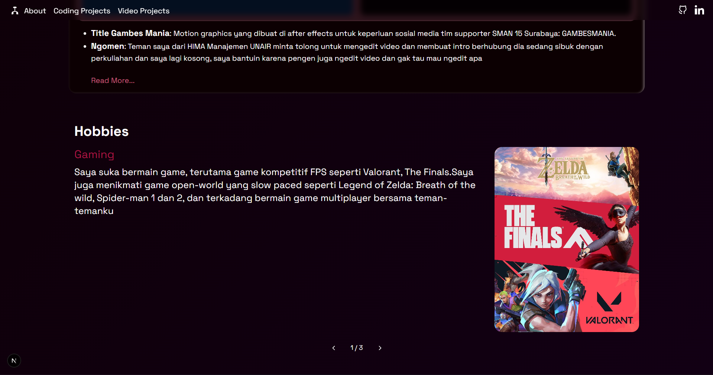

# Tugas Mandiri Pemrograman Berbasis Platform | Portofolio
## Arya Satwika | 24051204069
Website ini merupakan hasil dari pekerjaan yang ditunjukkan untuk memnuhi penugasan ujian tengah semester mata kuliah Pemrograman Berbasis Platform, yang diampu oleh Bapak Rifqi Abdillah, S.Tr. T., M. Kom

Dibuat dengan Next.JS, React dan Tailwind
Di Deploy menggunakan netlify

### Componenent dan Library yang digunakan
1. motion.dev
2. shadcn ui

### Page / Route
1. /: Homepage yang berisi informasi diri, beberapa project yang pernah dilakukan, dan hobi
2. /about: About yang berisi CV dan bio
3. /projects/coding: Projek koding yang kembangkan
4. /projects/video: Portoflio video yang saya edit atau bantu buat

### Tampilan Website

